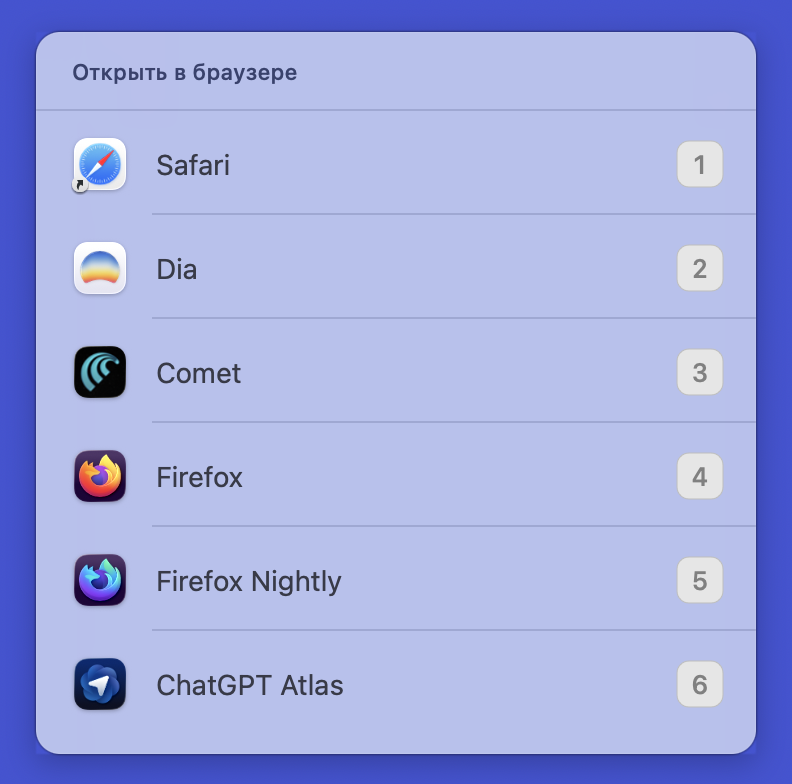
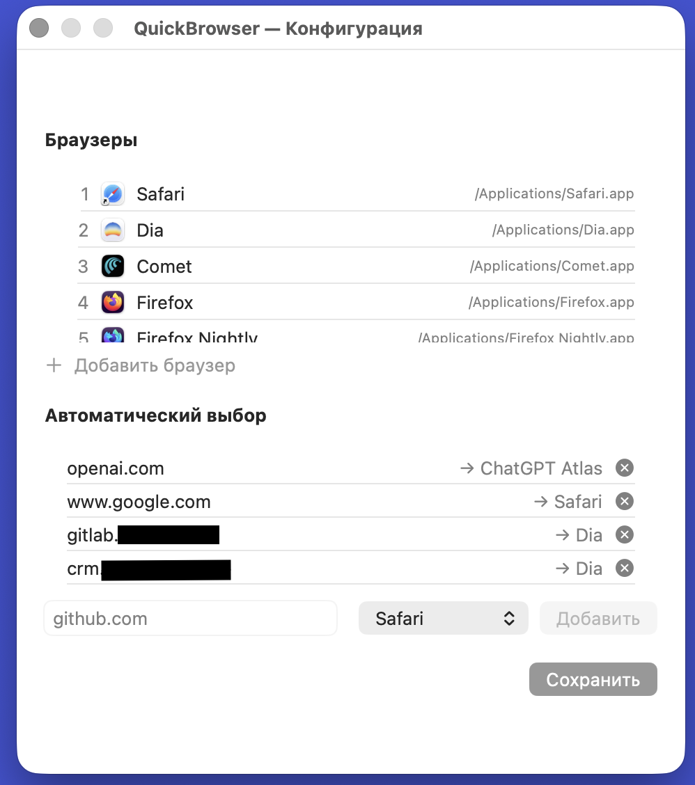
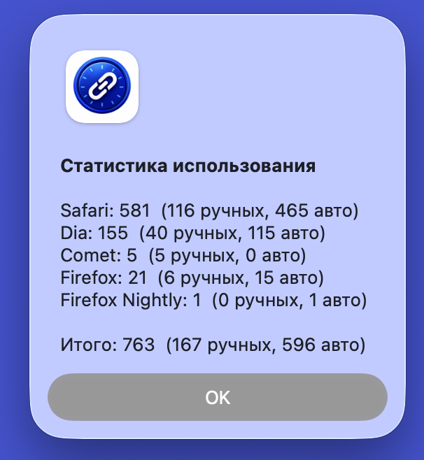
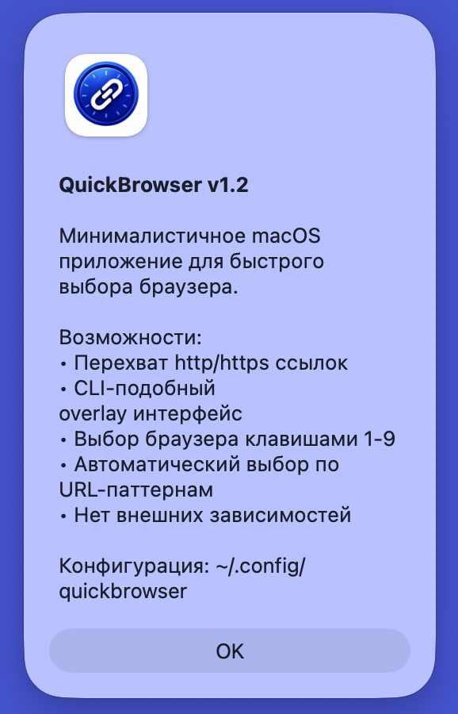

# QuickBrowser

A minimalist browser picker for macOS. Intercepts http/https links and either opens them in a chosen browser or routes them automatically based on URL patterns.

<table>
  <tr>
    <td align="center"><br><sub>Browser picker overlay</sub></td>
    <td align="center"><br><sub>Configuration editor</sub></td>
  </tr>
  <tr>
    <td align="center"><br><sub>Usage statistics</sub></td>
    <td align="center"><br><sub>About dialog</sub></td>
  </tr>
</table>

## Features

- **Browser picker overlay** — keyboard-first, pick a browser with keys `1`–`9`
- **Pattern-based routing** — URLs matching a pattern open in the assigned browser without prompting
- **Auto-learning** — after picking the same browser for a domain 5 times, QuickBrowser offers to remember the choice (or saves it silently if `autolearn=true`)
- **Usage statistics** — see how often each browser is used (manual vs. automatic)
- **SwiftUI config editor** — manage browsers and patterns from the menu bar
- **Zero dependencies** — single small Swift binary

## Installation

### 1. Build

Open the project in Xcode:

```bash
open QuickBrowser/QuickBrowser.xcodeproj
```

Select the **QuickBrowser** scheme with **My Mac** as target, then `Product` → `Build` (⌘B), or build a Release artifact from the terminal:

```bash
cd QuickBrowser
xcodebuild -project QuickBrowser.xcodeproj \
           -scheme QuickBrowser \
           -configuration Release \
           clean build
```

The Release build lands in:

```
~/Library/Developer/Xcode/DerivedData/QuickBrowser-*/Build/Products/Release/QuickBrowser.app
```

### 2. Copy to Applications

```bash
cp -R ~/Library/Developer/Xcode/DerivedData/QuickBrowser-*/Build/Products/Release/QuickBrowser.app \
      /Applications/
```

Or drag `QuickBrowser.app` into `/Applications` manually. Installation in `/Applications` is required — macOS only registers URL handlers for apps placed there.

### 3. Set as default browser

**Option A — System Settings (recommended)**

1. Open **System Settings** → **Desktop & Dock**
2. Scroll to **Default web browser**
3. Choose **QuickBrowser**

**Option B — Launch once**

```bash
open /Applications/QuickBrowser.app
```

macOS will register it as a URL handler. Then set it as default in System Settings.

### 4. Verify

```bash
open -a /Applications/QuickBrowser.app "https://github.com"
```

The configured browser should open (or the picker overlay if no pattern matches).

## Configuration

Create `~/.config/quickbrowser`:

```
# Settings
autolearn=true

# Browsers — format: key=path
1=/Applications/Safari.app
2=/Applications/Firefox.app
3=/Applications/Google Chrome.app

# Patterns — format: pattern browser_key
github.com 2
openai.com 1
stackoverflow 2
```

You can also edit the config from the menu bar: click the globe icon → **Edit configuration**.

### Config rules

- Lines starting with `#` are comments
- Empty lines are ignored
- `autolearn=true` saves learned patterns silently; otherwise QuickBrowser asks for confirmation
- Browser keys must be digits (`1`–`9`)
- Browser paths must exist
- Patterns are evaluated in file order — the **first** match wins

## Usage

After installation, QuickBrowser intercepts every http/https click:

- **URL matches a pattern** → opens automatically in the assigned browser
- **No match** → overlay appears; press `1`–`9` to pick, `Esc` to cancel
- **Same domain picked 5 times in a row** → QuickBrowser offers to add a pattern (or auto-adds it with `autolearn=true`)

## Pattern matching

Patterns are matched against both the URL host and the full URL string:

| Pattern | Matches |
|---------|---------|
| `github.com` | `https://github.com/...`, `https://api.github.com/...` |
| `api.example.com` | only the `api` subdomain |
| `stackoverflow` | any URL containing `stackoverflow` |

## Menu bar

Click the globe icon in the menu bar:

- **Edit configuration** — open the SwiftUI editor for browsers and patterns
- **Statistics** — show usage counts (manual vs. automatic) per browser
- **About** — version and feature summary
- **Quit** — exit QuickBrowser

## Troubleshooting

**Links don't open in QuickBrowser**
- Confirm `QuickBrowser.app` is in `/Applications` (not Downloads or Desktop)
- Re-select QuickBrowser as the default browser in System Settings
- If macOS caches an old version, change the Bundle ID and rebuild

**"Configuration not found"**
- Create `~/.config/quickbrowser` with at least one browser line, e.g. `1=/Applications/Safari.app`

**"Browser not found"**
- Verify the path in the config is correct and the `.app` exists

## Version

**v1.2** — Pattern-based routing, auto-learning, usage statistics, SwiftUI config editor
